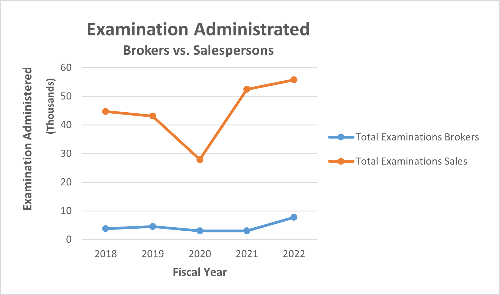
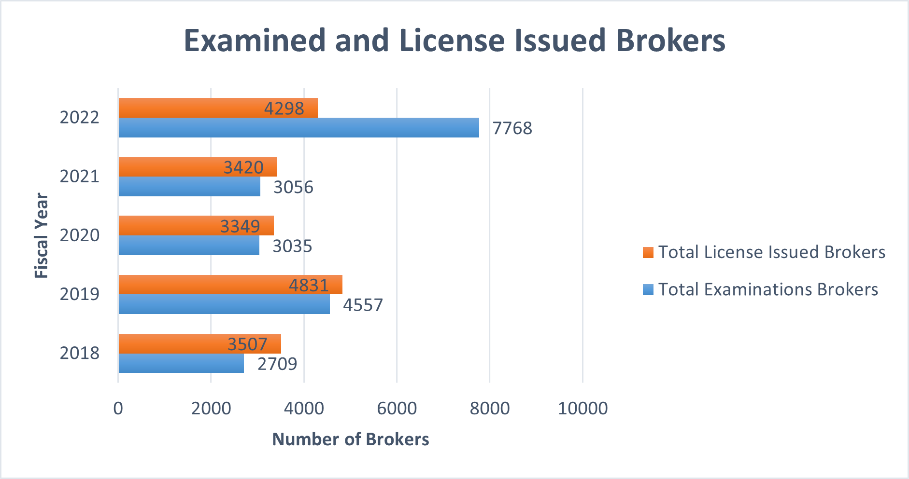

# California Real Estate Licensee Analysis

## Overview of the analysis
The Real Estate Licensee analysis uses the datasets from Department of Real Estate(DRE) in California to analyze the CA licensee and examinee for brokers and salespersons. Based on the DRE Licensee/Examinee statistics, we use a variety of visualization to explore the relationship of the recent 5 years Real Estate Licensee/Examinee. By analyzing these data, we provide recommandations to help the department to plan ahead for the next year and improve Real Estate licensing services.

## Results
- CA Licensee Population of brokers and salespersons: 
 

   

  
- Examinations: 
  - Fiscal year from 2018-2022, DRE administrated examinations:

   

  
  
 - License Issued after examination:
   - Brokers 

   

  - Salespersons 

   

## Summary

### Resources
1. https://www.dre.ca.gov/Stats

_______________________________________________________________________________________________________________________________________________________________

- Project Contributor: Phoebe J. Miao
- Email: phoebem2021data@gmail.com
