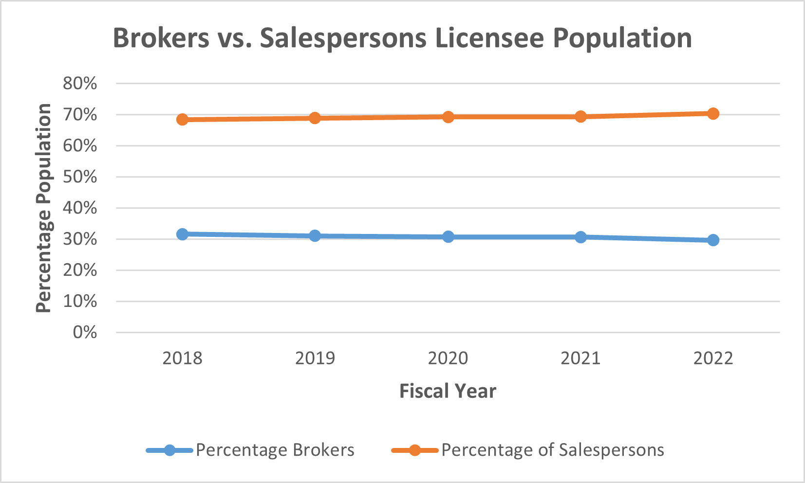

# California Real Estate Licensee Analysis

## Overview of the analysis
The Real Estate Licensee analysis uses the datasets from Department of Real Estate (DRE) in California to analyze the licensee and examinee of brokers and salespersons. Based on the recent five Fiscal years of DRE Licensee/Examinee statistics, we use a variety of visualization to explore the real estate business trend. Our goal is to provide a dashboard and recommendations with DRE, which can help the management to plan ahead for the next year and improve Real Estate licensing services.

## Results
### CA Licensee Population of brokers and salespersons: 
We use the CA Licensee population dataset from 2017-2022 to create a pivot table based on brokers and salespersons category and graphing line chat to visualize how their occupancy trend during rencent 5 years. As the graph shows below:

  - Broker has average **30%** based on the fiscal year. 
  - Salesperson has average **70%** share of the Licensee population.
  - The percentage of Broker and salesperson do not get affected during the COVID pandemic outcomes.
 

   

  
### Examinations Admininstrated: 
We filter and sort the dataset to fulfill the requirements, and visualize the results. Based on the Fiscal year from 2018-2022, DRE total examination administrated of broker and salesperson shows below:

  - From 2019-2020, **salespersons** took the exam has dramatically decrease comparing to brokers.
  - **Salespersons** increase sharply in recent 2 years. And, for broker examinees, who has grew significantly as well.
  - In the past two years, the pandemic will be an important factor that affect the people to taking the real estate exam.  

   

  
  
### License Issued after examination:
   - Brokers 

   

  
   - Salespersons 

   
   

   

## Summary

### Resources
1. https://www.dre.ca.gov/Stats

_______________________________________________________________________________________________________________________________________________________________

- Project Contributor: Phoebe J. Miao
- Email: phoebem2021data@gmail.com
