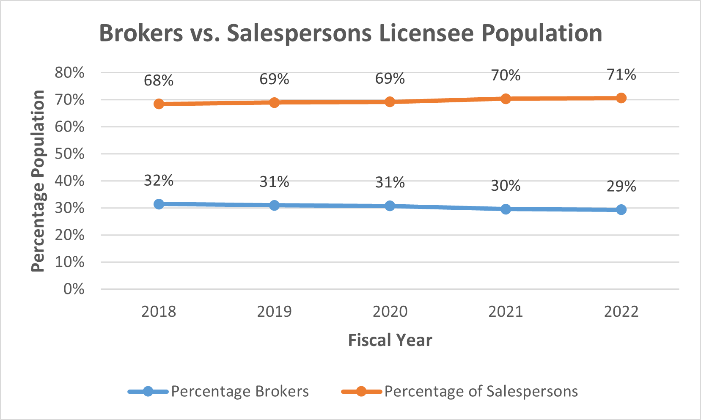
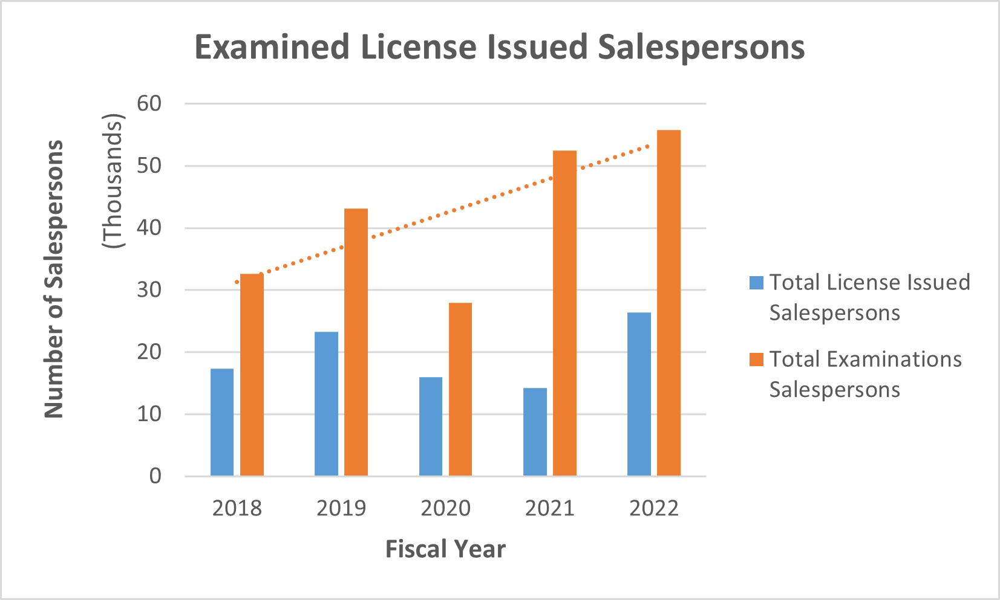

# California Real Estate Licensee Analysis

## Overview of the analysis
The Real Estate Licensee analysis uses the datasets from The California Department of Real Estate (DRE) to analyze the licensee and examinee of brokers and salespersons. Based on the recent five Fiscal years of DRE Licensee/Examinee statistics, we use a variety of visualization to explore the real estate business trend. Our goal is to provide a dashboard and recommendations with DRE, which can help the management to plan ahead for the next year and improve Real Estate licensing services.

## Results
### CA Licensee Population of brokers and salespersons: 
We use the CA Licensee population dataset from 2017-2022 to create a pivot table based on brokers and salespersons category and graphing line chat to visualize how their occupancy trend during rencent 5 years. As the graph shows below:

  - Broker has average **30%** based on the fiscal year. 
  - Salesperson has average **70%** share of the Licensee population.
  - The percentage of Broker and salesperson do not get affected during the COVID pandemic outcome.
 

   

  
### Examinations Admininstrated: 
We group the data by fiscal year, filter by examinated category, and visualize the results. Based on the Fiscal year from 2018-2022, the California Department of Real Estate total examination administrated of brokers vs. salespersons' graph shows below:

  - During fiscal year(FY) 2019-2020, the number of **salesperson exams administrated** have dramatically decrease. 
  - The number of **salespersons exams administrated** increased sharply after 2020; especially in FY 2022, it has reached a peak. 
  - We could expect that the DRE's operation are affected during the pandemic and that associated with its regulation/policy changed.  

   

  
  
### Total License Issued and examinees:
   - Brokers: In the FY 2022, the number of broker examinees for broker have significant increased. 
   - The trend of total license issued in these five years are very stable.

   

  
   - Salespersons 

   
   

   

## Summary

### Resources
1. https://www.dre.ca.gov/Stats

_______________________________________________________________________________________________________________________________________________________________

- Project Contributor: Phoebe J. Miao
- Email: phoebem2021data@gmail.com
